# mall
mall-shop
   ###1.首页展示

   ###2.未登录账号时点击加入购物车
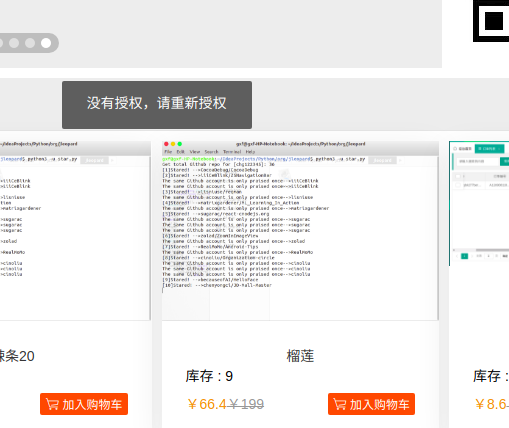

   ###3.登录账号时点击加入购物车,进入购物车页面
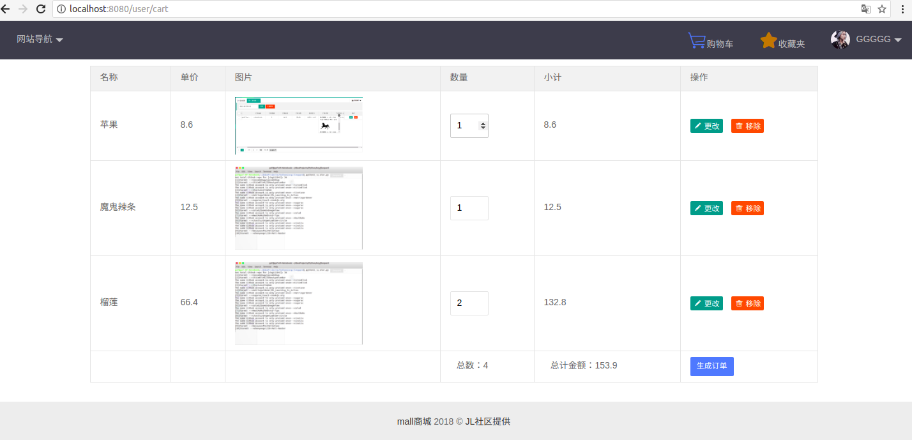

 ###4.要生成订单时要选择收货地址，没有地址时点击新增地址
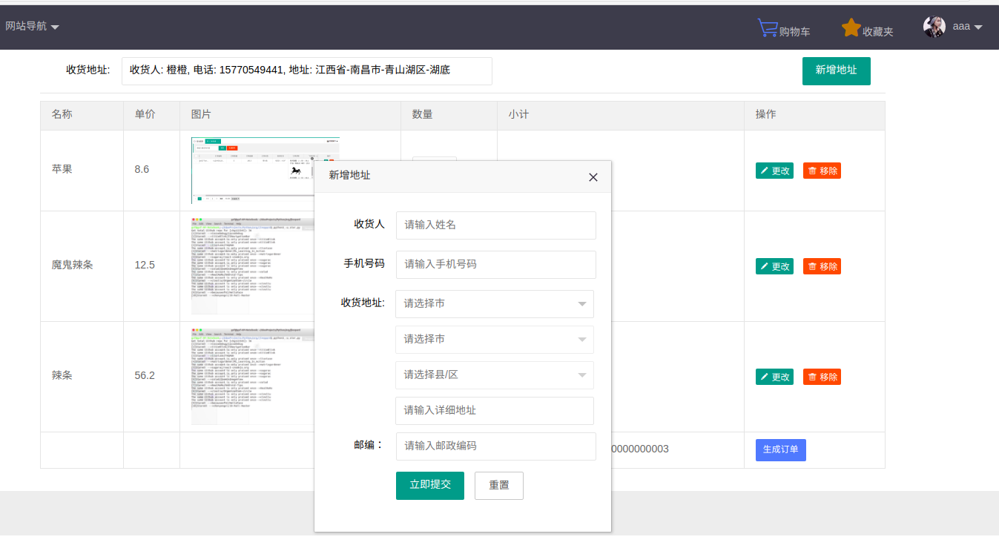

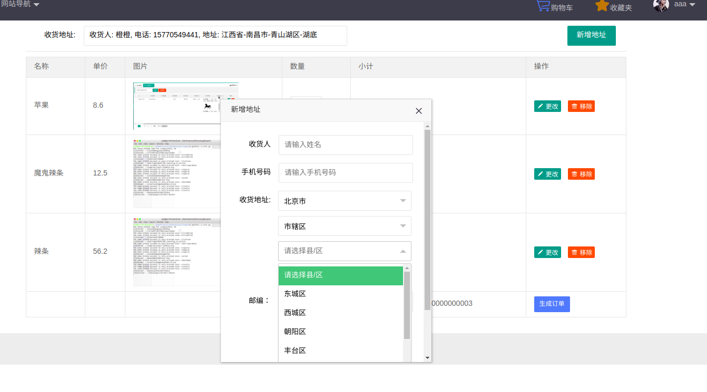

   ###5.点击生成订单
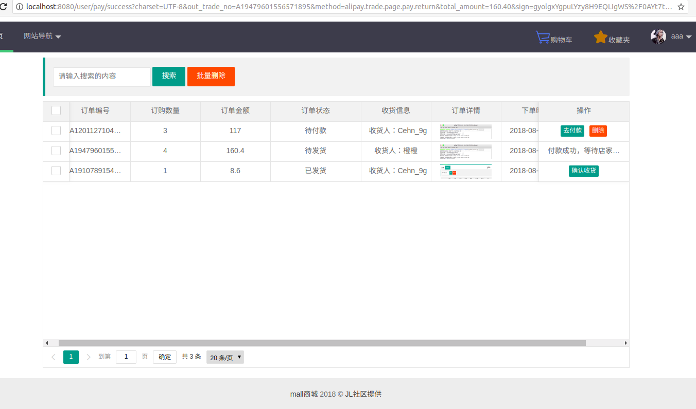

   ###6.未付款的订单点击付款，进入支付页面
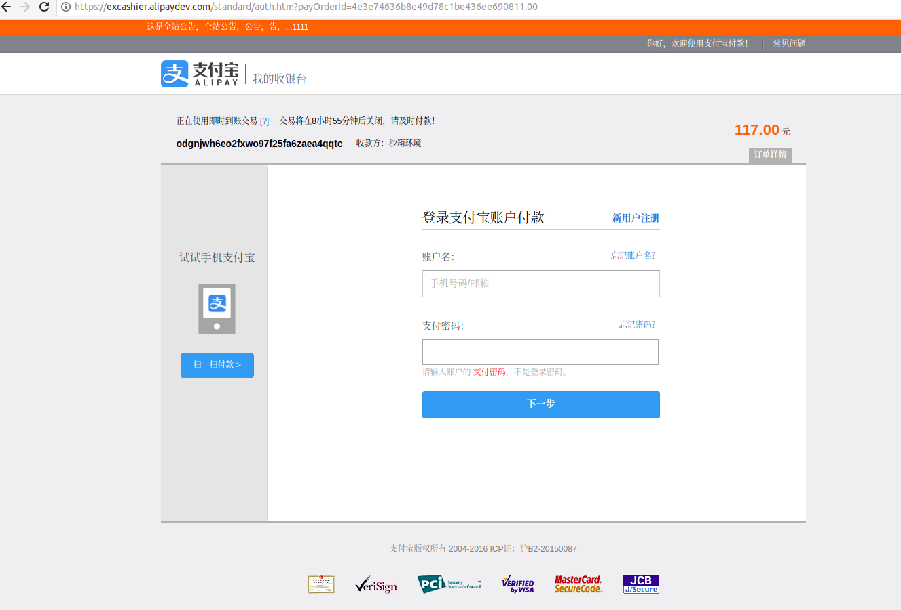

    -登录支付宝或者扫码支付
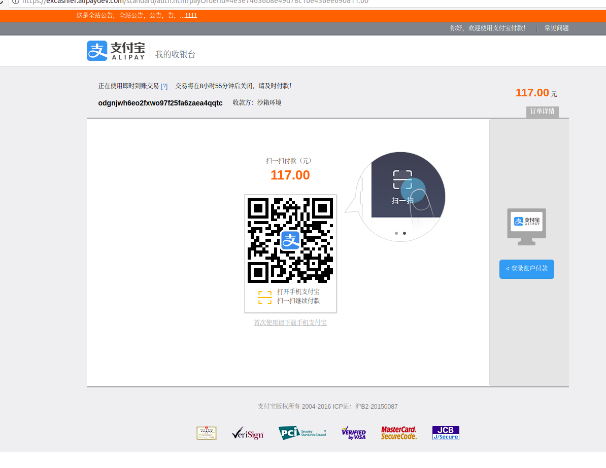
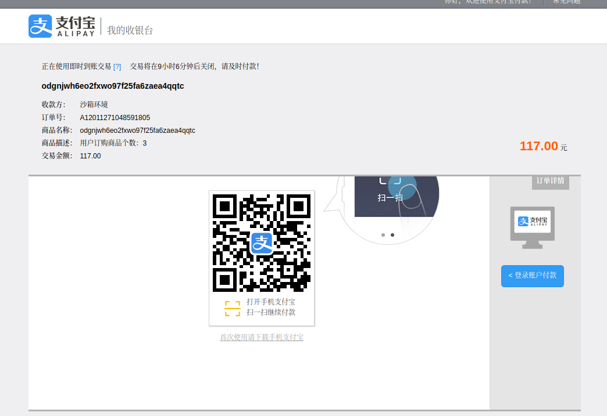

    -支付完成页面跳转
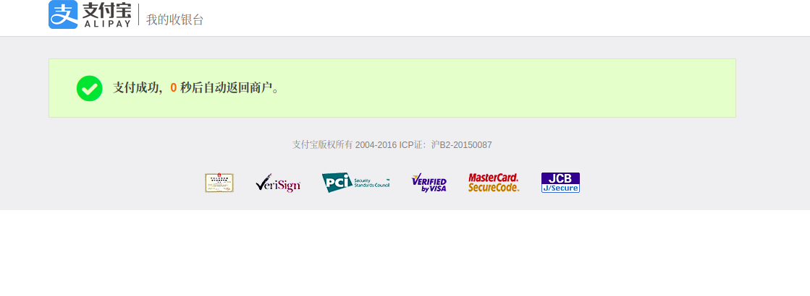

   ###7.支付成功则跳回订单管理页面
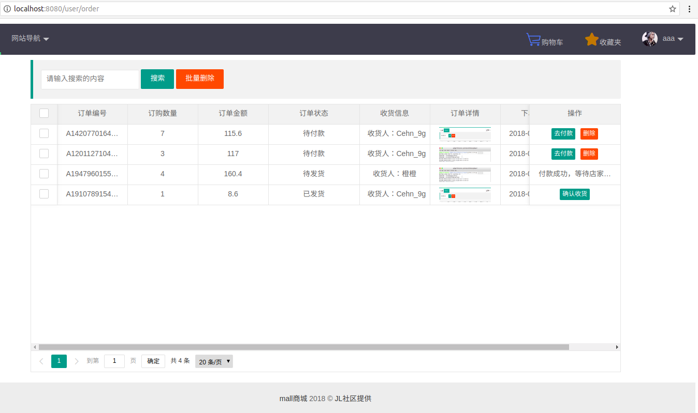

    -支付成功刷新订单状态，将订单状态置为已付款，待发货状态
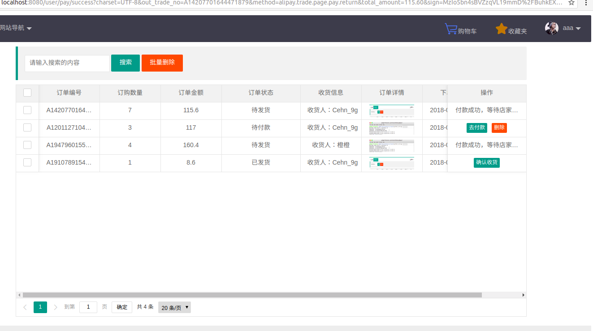

 ###8.发货了的订单点击确认收货，订单状态置为交易成功
 
 ######PS：只有未付款和交易成功的订单信息才能删除
 
 #end
 